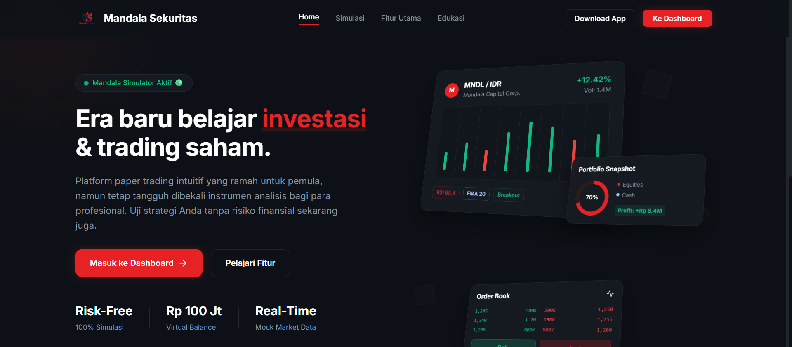
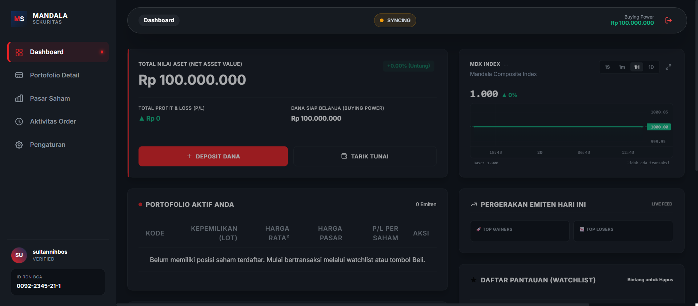
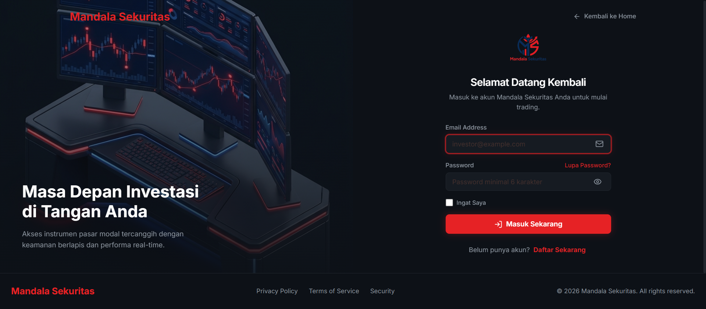
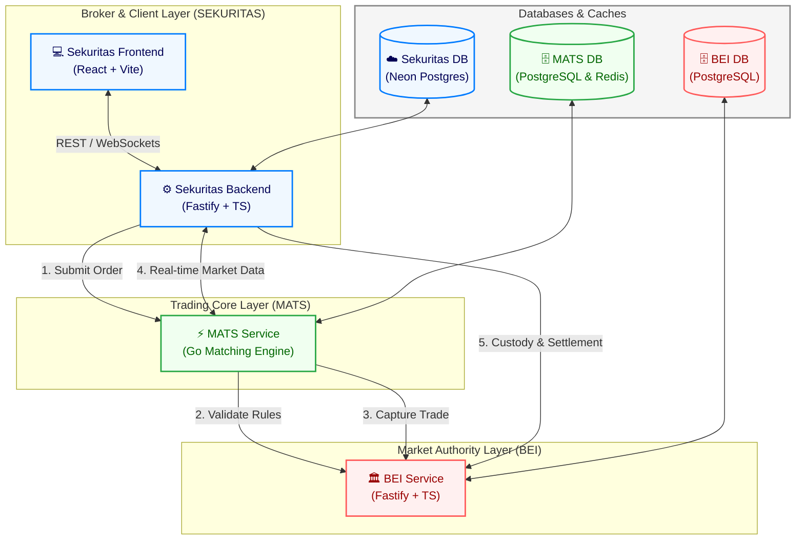

# 🌌 Mandala Exchange Ecosystem

[](https://golang.org)
[](https://nodejs.org)
[](https://www.typescriptlang.org)
[](https://react.dev)
[](https://www.fastify.io)
[](https://www.postgresql.org)
[](https://www.docker.com)

Selamat datang di repositori **Mandala Exchange**, platform simulasi perdagangan efek terintegrasi yang mensimulasikan ekosistem bursa saham sesungguhnya di Indonesia. Proyek ini dibagi menjadi tiga domain layanan utama guna memastikan pemisahan batas tanggung jawab (*system boundary*) yang jelas dan performa perdagangan yang optimal.

---

## 📸 Tampilan Dashboard & Pasar Saham

Dapatkan visualisasi real-time pasar saham dan antarmuka premium Mandala Exchange:

| Landing Page | Dashboard Utama | Pasar Saham |
| :---: | :---: | :---: |
|  |  |  |

---

## 🏛️ Arsitektur Sistem & Alur Data

Ekosistem Mandala Exchange dirancang dengan arsitektur mikro (*microservices*) berkinerja tinggi. Berikut adalah visualisasi alur interaksi runtime antar layanan:



---

## 📂 Struktur Repositori & Boundary Sistem

Repositori ini terorganisasi berdasarkan tanggung jawab fungsional masing-masing komponen:

| Modul | Deskripsi Peran / Boundary | Tautan Dokumentasi |
| :--- | :--- | :---: |
| **🏛️ BEI** | Market Authority. Mengelola master emiten, trading rules, broker member, trade capture, settlement, custody ledger, corporate action, reporting, dan surveillance. | [README.md](./BEI/README.md) |
| **⚡ MATS** | Mandala Automated Trading System. Mengelola order book (in-memory), continuous matching engine, validasi rules BEI, trade generation, dan distribusi market data realtime via WebSockets. | [README.md](./MATS/README.md) |
| **💼 SEKURITAS** | Mandala Sekuritas. Mengelola user/player, cash reservation, share reservation, order entry gateway, portofolio, leaderboards, dan antarmuka web trader. | [README.md](./SEKURITAS/README.md) |
| **🤖 BOT** | Automated trading investor. Bertindak sebagai penyedia likuiditas pasar, wajib masuk melalui gerbang Sekuritas (tunduk pada aturan pasar). | [PRD Dokumen](./docs/BOT/BOT_PRD.md) |

---

## 🌐 Konfigurasi Port Layanan

Semua modul dikonfigurasi untuk berjalan berdampingan pada port berikut:

| Layanan | Mode Development | Mode Production | Deskripsi |
| :--- | :--- | :--- | :--- |
| **Sekuritas Frontend** | `http://localhost:5173` | `http://localhost:4174` | Antarmuka pengguna (trader portal) |
| **Sekuritas Backend** | `http://localhost:3002` | `http://localhost:3003` | REST API Broker & Portofolio |
| **MATS Service** | `http://localhost:8082` | `http://localhost:8083` | HTTP API & WebSocket Market Data |
| **BEI Service** | `http://localhost:4100` | `http://localhost:4101` | REST API Authority & Admin Console |

---

## 🚀 Panduan Memulai Cepat (Quick Start)

Kami telah menyediakan skrip batch `start-all.bat` untuk meluncurkan seluruh lingkungan pengembangan dalam sekali perintah di sistem operasi Windows.

### Prasyarat
Pastikan Anda sudah menginstal aplikasi berikut:
- **GoLang** (versi 1.20+)
- **Node.js** (versi 18+)
- **Docker Desktop** (untuk PostgreSQL lokal & Redis)

### Langkah Inisialisasi

1. **Jalankan Skrip Startup Global:**
   ```bash
   # Jalankan dalam mode Development (Rekomendasi untuk testing lokal)
   start-all.bat development

   # Atau jalankan dalam mode Production (Dengan Cloudflare Tunnel)
   start-all.bat production
   ```
   *Skrip ini secara otomatis akan menjalankan Docker Containers, menjalankan migrasi database, melakukan seeding data awal BEI, dan meluncurkan semua dev server dalam jendela CMD terpisah.*

2. **Akses Dashboard:**
   - Trader Web App: `http://localhost:5173`
   - BEI Admin Console: `http://localhost:4100/admin`

---

## 🛡️ Kebijakan Keamanan Internal

Komunikasi antar-layanan diproteksi menggunakan **Service-to-Service Token Passing**. Setiap request internal wajib menyertakan header token berikut:
```http
x-service-token: <secure-service-token>
```
Detail token dan lingkup otorisasi (*scopes*) dapat ditemukan di masing-masing folder dokumentasi [BEI](./BEI/README.md) dan [MATS](./MATS/README.md).
