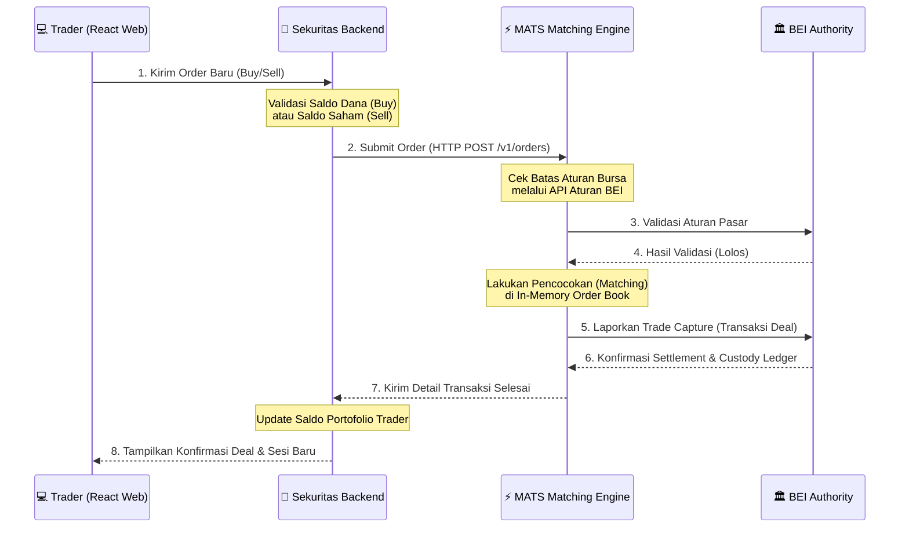

# 💼 SEKURITAS Service (Mandala Sekuritas)

[](https://react.dev)
[](https://vite.dev)
[](https://www.fastify.io)
[](https://orm.drizzle.team)
[](https://www.typescriptlang.org)
[](https://neon.tech)

**Mandala Sekuritas** adalah modul broker terintegrasi dan gerbang utama bagi para trader retail (*player*) untuk berinteraksi dengan ekosistem Mandala Exchange. Modul ini menyediakan antarmuka web interaktif yang intuitif, serta API Gateway yang mengelola akun trader, portofolio (kepemilikan saham & saldo dana), riwayat transaksi, leaderboards, pengiriman order ke matching engine (**MATS**), dan penarikan dana.

---

## 🏗️ Struktur Proyek

Layanan Sekuritas dibagi menjadi dua bagian terpisah untuk pemisahan *client-server* yang bersih:

```
SEKURITAS/
├── backend/          # Node.js + Fastify API Server
│   ├── src/          # Source code TypeScript (routes, db, controllers)
│   └── package.json  # Konfigurasi dependensi server
├── frontend/         # React + Vite Client Application
│   ├── src/          # Halaman portal trading, grafik, portofolio, dsb.
│   └── package.json  # Konfigurasi dependensi client web
└── docker-compose.yml # Konfigurasi database Postgres lokal & Redis
```

---

## ⚡ Panduan Menjalankan Layanan (Quick Start)

### 1. Inisialisasi Environment Global
Jalankan Docker Compose di root folder `SEKURITAS` untuk mengaktifkan database PostgreSQL lokal dan instansi Redis cache:
```bash
docker compose --env-file .env.docker.development -p mandala-sekuritas-dev up -d
```

### 2. Setup Backend Server
Masuk ke direktori `SEKURITAS/backend/` untuk melakukan konfigurasi:
```bash
cd backend
cp .env.example .env

# Instalasi paket & jalankan migrasi database
npm install
npm run db:migrate

# Jalankan server API (Dev mode)
npm run dev
```
> [!NOTE]
> Backend server akan berjalan pada port **3002** (Development) atau **3003** (Production).

### 3. Setup Frontend Web
Masuk ke direktori `SEKURITAS/frontend/` untuk menjalankan aplikasi web client:
```bash
cd ../frontend
cp .env.example .env.local

# Instalasi paket & jalankan dev server
npm install
npm run dev
```
> [!TIP]
> Antarmuka web trader dapat diakses melalui browser di alamat `http://localhost:5173`.

---

## 🧩 Tech Stack & Dependensi Utama

### ⚙️ Backend (API Server)
- **Fastify v5**: HTTP web framework berkinerja tinggi.
- **Drizzle ORM**: TypeScript-first ORM yang cepat untuk interaksi data.
- **pg (PostgreSQL)**: Driver pool koneksi database.
- **ioredis**: Driver caching dan pub/sub Redis.
- **Zod**: Validasi skema request payload & environment.
- **JSONWebToken (JWT)**: Autentikasi sesi login pengguna.
- **Resend SDK**: Pengiriman email transaksional dan OTP.

### 💻 Frontend (Aplikasi Web)
- **React v18 & Vite v8**: Bundler modern dan library UI reaktif.
- **Zustand**: State management yang ringan untuk menyimpan sesi trading & data portofolio.
- **React Router DOM v7**: Pengarah rute (*routing*) aplikasi multi-halaman.
- **Lightweight Charts**: Library grafik interaktif TradingView berkinerja tinggi untuk menampilkan pergerakan lilin (*candlestick*) harga saham emiten secara real-time.
- **Lucide React**: Set ikon modern yang rapi.

---

## 🏛️ Alur Transaksi Order (Order Flow)


