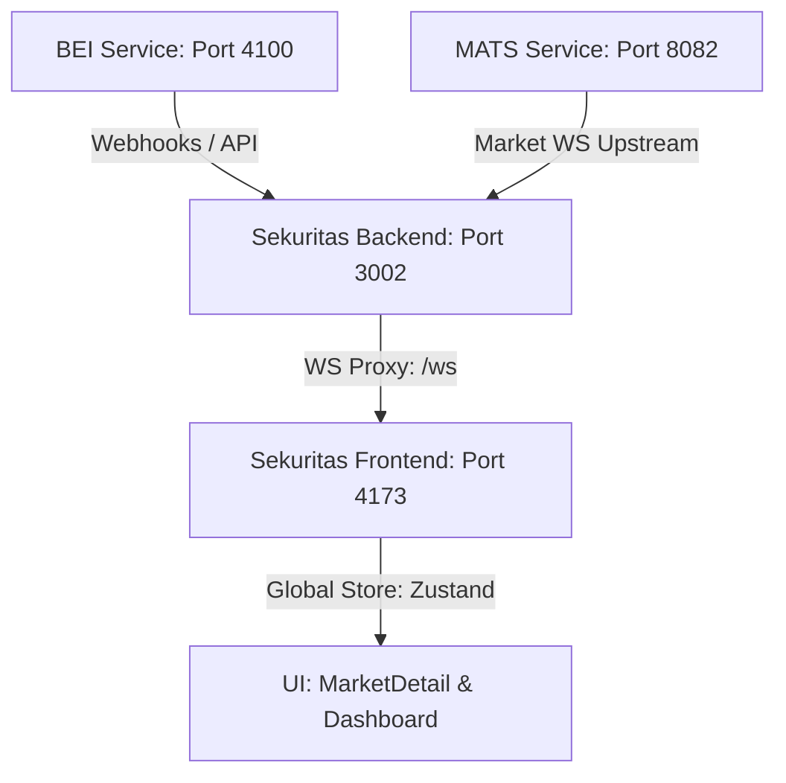

# Arsitektur & Aliran Data Pasar Mandala Exchange

Dokumen ini merinci bagaimana data pasar (seperti kedalaman antrean orderbook, harga terakhir, dan statistik transaksi harian) dialirkan dari bursa efek simulasi hingga dirender pada UI Sekuritas. Dokumentasi ini dibuat untuk memudahkan pemahaman arsitektur sistem dan pengerjaan fitur di masa mendatang.

## Peta Komponen Utama

Sistem Mandala Exchange terdiri dari empat layanan utama yang saling terintegrasi:

### 1. BEI Service (Bursa Efek Indonesia)
- **Fungsi**: Layanan simulasi otoritas bursa. Menyimpan database emiten (`listed_securities`, `issuers`), pencatatan transaksi final (`trades`), pengumuman resmi, dan aksi korporasi.
- **Lokasi File Utama**:
  - Skema Database: [schema.ts](file:///e:/_BELAJAR%20PROGRAMMING_/github/Mandala-Exchange/BEI/src/db/schema.ts)
  - Endpoint Emiten & Notasi: [issuers.ts](file:///e:/_BELAJAR%20PROGRAMMING_/github/Mandala-Exchange/BEI/src/routes/issuers.ts)
  - Endpoint Lilin (Candles) & Trades: [trades.ts](file:///e:/_BELAJAR%20PROGRAMMING_/github/Mandala-Exchange/BEI/src/routes/trades.ts) (Candles dihitung dinamis dari database `trades`).

### 2. MATS Service (Mandala Automated Trading System)
- **Fungsi**: Engine pencocokan transaksi (matching engine) reguler yang super cepat. Mengelola antrean bid-ask (`BookSnapshot`) secara in-memory dan statistik akumulasi transaksi berjalan (`MarketSummary`).
- **Mekanisme Broadcast**: Mengirimkan data real-time menggunakan WebSocket melalui endpoint `/v1/market-data/ws`.
- **Lokasi File Utama**:
  - Pengelolaan Summary Pasar: [summary.go](file:///e:/_BELAJAR%20PROGRAMMING_/github/Mandala-Exchange/MATS/internal/marketdata/summary.go)
  - WebSocket Hub: [ws.go](file:///e:/_BELAJAR%20PROGRAMMING_/github/Mandala-Exchange/MATS/internal/marketdata/ws.go)
  - Model Data: [types.go](file:///e:/_BELAJAR%20PROGRAMMING_/github/Mandala-Exchange/MATS/internal/domain/types.go)

### 3. Sekuritas Backend (WS Proxy & API)
- **Fungsi**: Bertindak sebagai proxy perantara untuk autentikasi user dan penyaluran WebSocket. Dia terhubung ke upstream MATS WS dan mendistribusikan semua event ke seluruh web client yang aktif.
- **WebSocket Caching**: Agar saat user berpindah halaman saham mereka langsung melihat data instan tanpa harus menunggu trade baru terjadi, proxy backend men-cache snapshot data terakhir (`depth_snapshot`, `last_price`, `market_summary`, `session_state`).
- **Lokasi File Utama**:
  - WebSocket Proxy: [market-ws-proxy.ts](file:///e:/_BELAJAR%20PROGRAMMING_/github/Mandala-Exchange/SEKURITAS/backend/src/services/market-ws-proxy.ts)
  - Routing Market: [market.ts](file:///e:/_BELAJAR%20PROGRAMMING_/github/Mandala-Exchange/SEKURITAS/backend/src/routes/market.ts)

### 4. Sekuritas Frontend (Zustand Store & React UI)
- **Fungsi**: Menyajikan visualisasi pasar kepada pengguna.
- **Penyimpanan State**: WebSocket dikoneksikan secara global di tingkat layout utama dashboard ([Dashboard.tsx](file:///e:/_BELAJAR%20PROGRAMMING_/github/Mandala-Exchange/SEKURITAS/frontend/src/pages/Dashboard.tsx)). Setiap pesan WebSocket diproses oleh Zustand store global untuk memperbarui state reaktif `market`.
- **UI Render**: Halaman detail emiten ([MarketDetail.tsx](file:///e:/_BELAJAR%20PROGRAMMING_/github/Mandala-Exchange/SEKURITAS/frontend/src/pages/MarketDetail.tsx)) mengonsumsi data `depth` dan `summaries` dari store untuk merelasikan visual orderbook side-by-side dan 12 metrik statistik harian.
- **Lokasi File Utama**:
  - Zustand Store: [useStore.ts](file:///e:/_BELAJAR%20PROGRAMMING_/github/Mandala-Exchange/SEKURITAS/frontend/src/store/useStore.ts)
  - Detail Emiten & Orderbook UI: [MarketDetail.tsx](file:///e:/_BELAJAR%20PROGRAMMING_/github/Mandala-Exchange/SEKURITAS/frontend/src/pages/MarketDetail.tsx)

---

## Aliran Siklus Event WebSocket Real-time

Berikut adalah daftar event real-time yang mengalir dari MATS ke UI:

1. `depth_snapshot`: Berisi list antrean `bids` dan `asks` (diurutkan di frontend untuk menyusun orderbook side-by-side 10 tingkat).
2. `last_price`: Berisi harga pencocokan transaksi terakhir untuk emiten tertentu.
3. `market_summary`: Berisi data dinamis harian emiten (`open`, `high`, `low`, `volume`, `value`, `frequency`).
4. `session_state` & `session_timer`: Berisi status sesi bursa (`pre_open`, `continuous`, `closed`, dll.) dan sisa waktu sesi.
5. `trade_tape`: Berisi daftar trade instan yang baru saja matched (untuk running trades).
