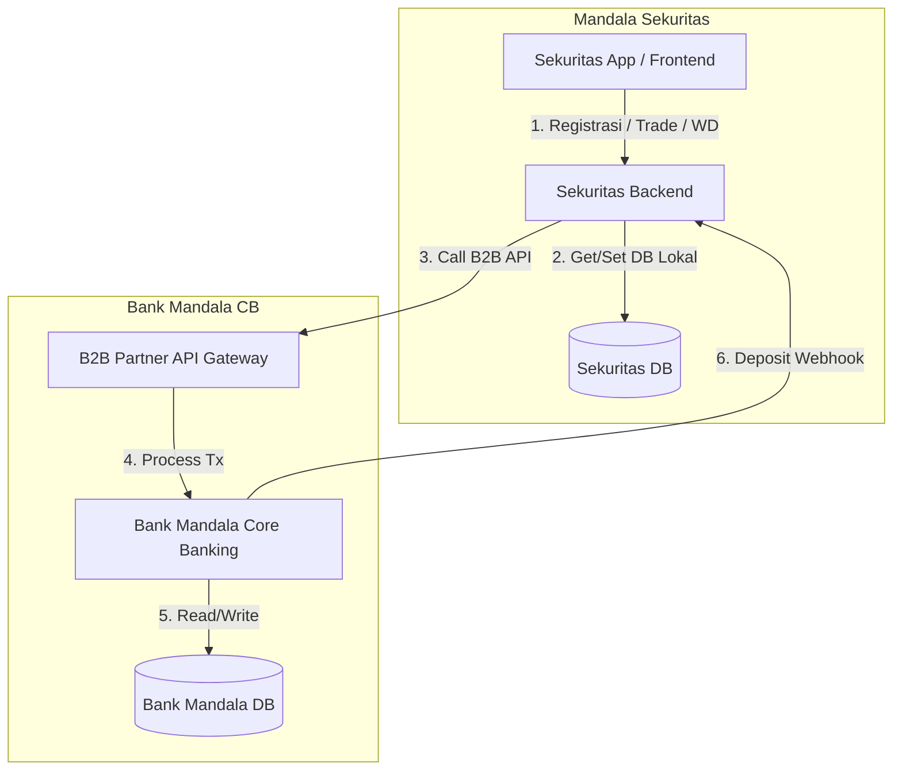

# Proposal Integrasi RDN (Rekening Dana Nasabah)

Proposal ini merinci konsep, arsitektur, spesifikasi API, dan alur integrasi untuk menghubungkan **Bank Mandala CB** (sebagai bank administrator RDN) dan **Mandala Sekuritas** (sebagai broker trading saham).

---

## 1. Arsitektur Integrasi

Integrasi ini memerlukan penyesuaian di kedua sisi sistem untuk mendukung operasi berikut:
1. **KYC & Registrasi RDN**: Mandala Sekuritas meminta Bank Mandala CB menerbitkan rekening RDN baru untuk nasabah yang terverifikasi.
2. **Top Up / Deposit Real-time**: Bank Mandala CB mengirimkan callback ke Mandala Sekuritas setiap ada dana masuk ke rekening RDN.
3. **Withdrawal / Debet Dana**: Mandala Sekuritas menginstruksikan Bank Mandala CB untuk mentransfer dana dari RDN nasabah ke rekening bank pribadi nasabah.
4. **Trade Settlement**: Pemindahan dana riil hasil transaksi trading (netting harian) dari RDN nasabah ke Rekening Pool Sekuritas di Bank Mandala CB.



---

## 2. Perubahan Desain Database

### A. Bank Mandala CB
Saat ini, Bank Mandala CB mengelola tipe akun tabungan reguler. Kita perlu:
1. Menambahkan tipe akun baru `rdn` pada kolom `account_type` di tabel `bank_accounts`.
2. Membuat skema pencatatan kredensial institusi/partner (API Key, IP Whitelist, dan Webhook URL milik Mandala Sekuritas).

### B. Mandala Sekuritas
Saat ini, RDN pada `rdn_references` dihasilkan secara random lewat fungsi simulasi. Kita perlu:
1. Mengubah status RDN dari simulasi menjadi data riil yang diperoleh dari Bank Mandala CB.
2. Menambahkan tabel `withdrawal_requests` untuk mengelola antrean dan status penarikan dana dari RDN nasabah ke rekening pribadi terdaftar.

---

## 3. Spesifikasi API Baru (Bank Mandala CB)

Untuk melayani Mandala Sekuritas, Bank Mandala CB harus mengekspos endpoint B2B yang diproteksi dengan keamanan tingkat tinggi (API Key + HMAC Signature + IP Whitelisting):

### A. POST `/api/b2b/accounts/rdn` (Registrasi RDN)
Digunakan oleh Sekuritas untuk membukakan RDN baru bagi nasabahnya.

* **Payload Request**:
  ```json
  {
    "userId": "usr_998877",
    "name": "BUDI UTOMO",
    "nik": "3171010101010001",
    "sid": "IDD1234567A",
    "sre": "SRE99887766"
  }
  ```
* **Response (Success 201)**:
  ```json
  {
    "success": true,
    "data": {
      "accountNumber": "96910002134",
      "accountName": "BUDI UTOMO - MANDALA SEKURITAS RDN",
      "currency": "IDR",
      "status": "active"
    }
  }
  ```

### B. GET `/api/b2b/accounts/rdn/:accountNumber/balance` (Cek Saldo Riil RDN)
Digunakan untuk sinkronisasi saldo trading dengan saldo riil bank.

* **Response (Success 200)**:
  ```json
  {
    "success": true,
    "data": {
      "accountNumber": "96910002134",
      "balance": "15000000.00",
      "currency": "IDR"
    }
  }
  ```

### C. POST `/api/b2b/transfers/debit` (Debet RDN - Withdrawal / Settlement)
Digunakan untuk memotong dana dari RDN. Hanya bisa didebet ke rekening tujuan tertentu (rekening pool Sekuritas atau rekening bank pribadi nasabah yang terdaftar).

* **Payload Request**:
  ```json
  {
    "sourceAccountNumber": "96910002134",
    "destinationAccountNumber": "9691601202",
    "amount": "500000.00",
    "description": "Withdrawal Mandala Sekuritas Budi Utomo",
    "idempotencyKey": "wd-key-uuid-12345"
  }
  ```
* **Response (Success 200)**:
  ```json
  {
    "success": true,
    "data": {
      "transactionId": "TX-10029384",
      "sourceAccountNumber": "96910002134",
      "amount": "500000.00",
      "status": "success",
      "createdAt": "2026-06-19T18:40:00Z"
    }
  }
  ```

---

## 4. Alur Webhook Deposit (Real-Time Top Up)

Ketika ada dana masuk ke RDN nasabah di Bank Mandala CB (misal transfer dari ATM/M-Banking bank lain):

1. **Bank Mandala CB** mendeteksi transfer masuk ke akun ber-`account_type` = `rdn`.
2. **Bank Mandala CB** mengirim request webhook ke **Mandala Sekuritas**:
    * **Endpoint**: `POST https://api.mandalasekuritas.com/api/v1/webhooks/rdn-deposit`
    * **Payload**:
      ```json
      {
        "event": "rdn.deposit",
        "rdn": "96910002134",
        "amount": "1000000.00",
        "transactionId": "TX-BANK-889922",
        "timestamp": "2026-06-19T18:42:00Z"
      }
      ```
3. **Mandala Sekuritas** memproses webhook:
    * Validasi signature webhook untuk memastikan pengirimnya adalah Bank Mandala CB.
    * Cari akun broker yang memiliki RDN tersebut di tabel `rdn_references`.
    * Update saldo `available` di tabel `cash_balances`.
    * Catat history transaksi di tabel `ledger_movements` dengan tipe `DEPOSIT`.
    * Kembalikan HTTP `200 OK` ke Bank Mandala CB.

---

## 5. Rencana Eksekusi Bertahap

Untuk mengimplementasikan integrasi ini secara aman tanpa mengganggu sistem trading saat ini, berikut adalah fase implementasi yang diusulkan:

### Fase 1: Pengembangan API B2B & Webhook di Bank Mandala CB
* Tambahkan tipe `rdn` ke skema/enum tabungan.
* Buat modul B2B API controller & router khusus untuk pendaftaran RDN dan Transfer Debet RDN.
* Implementasikan logic pengiriman webhook deposit pada module `transactions.service.ts` Bank Mandala CB.

### Fase 2: Integrasi Registrasi RDN & Webhook di Mandala Sekuritas
* Pasang HTTP client/SDK untuk menembak API Bank Mandala CB dari Sekuritas backend.
* Ubah flow pendaftaran di `account-service.ts` agar tidak meng-generate random RDN, melainkan memanggil API registrasi RDN Bank Mandala CB.
* Buat router webhook `/api/v1/webhooks/rdn-deposit` di Sekuritas backend untuk memproses callback deposit.

### Fase 3: Integrasi Penarikan Dana (Withdrawal) & Settlement Trading
* Ubah flow withdrawal di Sekuritas agar mendebet RDN nasabah secara riil di Bank Mandala CB.
* Sesuaikan logic settlement agar dana di-debet/kredit di Bank Mandala CB pada saat bursa (BEI) menyelesaikan perdagangan (T+1/T+2).

### Fase 4: Pengujian End-to-End & Simulasi Kegagalan
* Simulasi kegagalan koneksi bank saat registrasi.
* Simulasi retry webhook deposit jika Sekuritas backend down sementara.
* Uji rekonsiliasi berkala (reconciliation job) saldo antara database lokal Sekuritas dan saldo fisik di Bank Mandala CB.

---

> [!NOTE]
> Integrasi ini akan membuat Mandala Sekuritas menjadi simulator pasar saham yang sangat mendekati dunia nyata karena sistem perbankannya terintegrasi penuh secara real-time.
