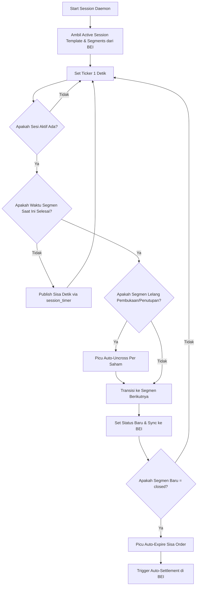

# Dokumentasi Sesi Perdagangan (Trading Session) - Mandala Exchange

Dokumen ini menjelaskan struktur sesi perdagangan, aturan segmen perdagangan, serta bagaimana otomatisasi transisi segmen dikelola di dalam ekosistem Mandala Exchange (BEI & MATS).

---

## 1. Struktur Sesi Perdagangan
Dalam simulasi Bursa Efek Indonesia (BEI) di Mandala Exchange, sesi perdagangan didasarkan pada template **"Mandala Regular Session MVP"**. Satu sesi penuh terdiri dari **8 segmen** yang dijalankan secara berurutan:

| Sequence | Segmen Sesi (`status`) | Durasi Default | Order Entry | Cancel / Amend | Deskripsi & Aksi Sistem |
| :---: | :--- | :---: | :---: | :---: | :--- |
| **1** | `pre_open` | 300 detik (5 mnt) | **Ya** | **Ya** | Masuknya order pembuka sebelum jam perdagangan reguler dimulai. |
| **2** | `opening_auction` | 60 detik (1 mnt) | **Ya** | **Tidak** | Periode lelang pembukaan. Setelah segmen berakhir, MATS akan melakukan pencocokan harga otomatis (*auto-uncrossing*). |
| **3** | `continuous` | 1800 detik (30 mnt)| **Ya** | **Ya** | Sesi perdagangan utama. Pencocokan order (*matching*) dilakukan secara langsung / real-time. |
| **4** | `pre_close` | 180 detik (3 mnt) | **Ya** | **Ya** | Pengumpulan order penutupan. |
| **5** | `non_cancellation` | 60 detik (1 mnt) | **Ya** | **Tidak** | Pemasukan order penutupan tetap diperbolehkan, namun order yang sudah masuk tidak dapat dibatalkan atau diubah. |
| **6** | `closing_auction` | 60 detik (1 mnt) | **Ya** | **Tidak** | Lelang penutupan. Setelah segmen berakhir, MATS melakukan pencocokan harga otomatis (*auto-uncrossing*). |
| **7** | `post_closing` | 300 detik (5 mnt) | **Ya** | **Tidak** | Sesi perdagangan pasca-penutupan pada harga penutupan yang sudah terbentuk. |
| **8** | `closed` | 0 detik | **Tidak**| **Tidak** | Sesi perdagangan hari itu resmi ditutup. Semua order yang berstatus open (tidak ter-fill) otomatis kedaluwarsa (*auto-expire*). |

---

## 2. Otomatisasi Transisi Segmen Sesi
Transisi antar segmen berjalan secara otomatis melalui komponen **Session Daemon** di MATS yang ditulis dalam bahasa Go ([daemon.go](file:///e:/_BELAJAR%20PROGRAMMING_/github/Mandala-Exchange/MATS/internal/session/daemon.go)).

### Alur Kerja Transisi Otomatis

1. **Daemon Ticker**: MATS menjalankan loop daemon yang mendeteksi pergantian waktu setiap `1` detik.
2. **Kalkulasi Sisa Waktu**: Setiap detik, sisa waktu segmen yang sedang berjalan dipublikasikan ke event bus Redis (`session_timer`) agar frontend/client dapat menampilkan hitung mundur (countdown).
3. **Pemicu Auto-Uncross**: Ketika waktu segmen `opening_auction` atau `closing_auction` telah habis, daemon secara otomatis memanggil fungsi `UncrossAuction` untuk menghitung harga pembukaan/penutupan teoritis dan mencocokkan transaksi di pasar.
4. **Pembaruan Status Bursa**: Daemon memajukan indeks segmen ke langkah berikutnya dan menyinkronkan status tersebut ke API bursa BEI (`POST /integration/mats/sessions/active/status`).
5. **Auto-Expire Order**: Ketika sesi bursa masuk ke segmen `closed`, daemon akan langsung memanggil `ExpireOpenOrders` untuk membatalkan semua order aktif yang masih tersisa secara otomatis.
6. **Auto-Settlement**: Setelah status bursa di BEI diperbarui menjadi `closed`, API BEI akan secara otomatis membuat batch settlement baru dan memprosesnya untuk melakukan kliring & penyelesaian dana/saham transaksi hari itu ([rules.ts:L226-L290](file:///e:/_BELAJAR%20PROGRAMMING_/github/Mandala-Exchange/BEI/src/routes/rules.ts#L226-L290)).
